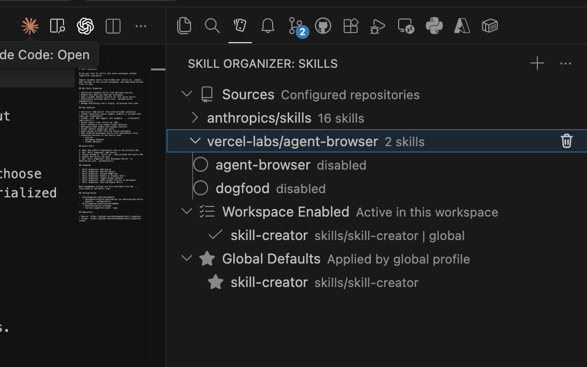

# Skill Organizer

Bring your best AI skills into every workspace without repetitive copy/paste.

Import reusable skills from GitHub and `skills.sh`, choose what belongs in the current workspace, and keep materialized files in sync.



## Why Skill Organizer

- Centralize reusable skills from multiple sources.
- Enable only what you need per workspace.
- Keep a global default profile for your go-to skills.
- Materialize selected skills into `.github/skills` automatically.
- Manage everything from a single, structured tree view.

## Key Features

- One-click `Add Source` flow with provider selection.
- GitHub repository source support (public or private with local git credentials).
- GitHub `tree` URL support (for example: `.../tree/main/tools/skills`).
- Direct import from `skills.sh` URLs.
- Skill discovery from common folder patterns.
- Workspace-level enable and disable controls.
- Global default toggle per skill.
- Manual vs managed materialized skill tracking.
- Apply global profile into the active workspace.
- Sync selected workspace skills into destination files.
- Organized sections in the Skills view:
  - Sources
  - Materialized
  - Workspace Enabled
  - Global Defaults

## Quick Start

1. Open the **Skill Organizer** view in the Activity Bar.
2. Run `Skill Organizer: Add Source`.
3. Choose GitHub or `skills.sh`, then provide the source URL.
4. Enable the skills you want.
5. Run `Skill Organizer: Apply Sync (Overwrite Managed Skills)` to materialize into `.github/skills`.
6. Optional: Use `Detach from Source` in the Materialized section to protect a copied skill from updates.

## Commands

- `Skill Organizer: Add Source`
- `Skill Organizer: Refresh Skills`
- `Skill Organizer: Extend AGENTS.md`
- `Skill Organizer: Enable or Disable Skill`
- `Skill Organizer: Toggle Global Default`
- `Skill Organizer: Apply Global Profile to Workspace`
- `Skill Organizer: Apply Sync (Overwrite Managed Skills)`
- `Skill Organizer: Detach from Source`
- `Skill Organizer: Reconnect to Source`
- `Skill Organizer: Update Managed Skill`
- `Skill Organizer: Uninstall Materialized Skill`

## Manual vs Managed Skills

Skill Organizer tracks materialized folders in `.skill-organizer.manifest.json`:

```json
{
  "managedFolders": ["example-skill"],
  "manualFolders": ["my-handcrafted-skill"]
}
```

- Managed (`package`) skills are updated/replaced by sync.
- Manual (`manual`) skills are protected from sync updates and removals.
- Existing manifests migrate automatically by adding `manualFolders: []` when missing.

### Protection Rules

- Sync skips manual folders (they remain untouched).
- `Update Managed Skill` is only available for managed entries.
- `Uninstall Materialized Skill` requires force confirmation for manual entries.
- `Detach from Source` and `Reconnect to Source` move skills between manifest arrays.

Most management actions are also available from the `...` title menu in the Skills view.

## Configuration

- `skillOrganizer.destinationPath`
  - Workspace-relative destination for materialized skills.
  - Default: `.github/skills`
- `skillOrganizer.materializationMode`
  - Materialization strategy.
  - Current supported value: `copy`

## Repository

- Source: `https://github.com/unthinkmedia/skill_organizer`
- Issues: `https://github.com/unthinkmedia/skill_organizer/issues`
