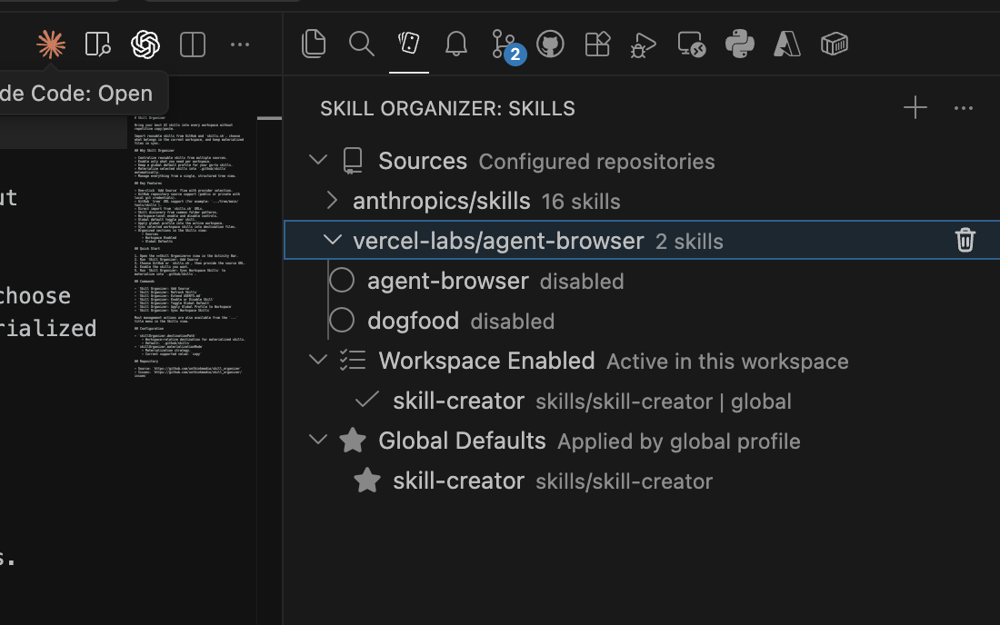

# Skill Organizer

A VS Code extension that turns AI skills into portable, version-controlled building blocks you can import, organize, share, and keep in sync across every workspace.



## The Problem

AI coding assistants like GitHub Copilot, Claude, and Cursor support custom skills — markdown files that teach the model domain-specific knowledge, workflows, or coding conventions. Skills are powerful, but managing them is not:

- **Copy/paste sprawl** — You find a useful skill in a repo or on skills.sh and manually copy it into your project. Then you do it again in the next project. And the next. Every workspace accumulates its own stale snapshot.
- **No update path** — When the upstream skill improves, you have no way to know or pull the changes. Your local copy silently drifts out of date.
- **No curation** — You can't easily browse what's available, search for skills by intent, or toggle them on and off per workspace. Skills either exist in the folder or they don't.
- **No sharing workflow** — You build a great skill locally but there's no streamlined way to contribute it back to a shared repo or the community.
- **Inconsistent team setups** — Every engineer on the team assembles a different set of skills by hand. There is no profile, no defaults, and no way to sync a baseline.
- **No governance** — AGENTS.md and skill definitions grow organically with no tooling to audit or reconcile them.

Skill Organizer solves all of this from inside VS Code.

## What You Can Do

### Import Skills from Anywhere

Connect to GitHub repositories (public or private), paste a `skills.sh` URL, or point at a GitHub tree path. Skill Organizer discovers every skill in the source and makes them available to browse and enable.

### Enable per Workspace, Default Globally

Toggle skills on or off for each workspace independently. Mark your go-to skills as **global defaults** so they materialize into every project automatically — no more forgetting to set up your favorite skills in a new repo.

### Stay in Sync

When a source skill is updated upstream, run **Resync** or **Update Managed Skill** to pull the latest version. Skills you've customized locally can be **detached from source** so sync never overwrites your changes.

### Search by Intent

Run **Search Skills** and describe what you need in plain language — "help me deploy", "set up auth", "write tests". An LLM-powered search ranks your entire catalog by relevance. When no language model is available, fast fuzzy matching takes over.

### Contribute Back via PR

Built or improved a skill? **Submit Skill as PR** opens a pull request against any GitHub repo — an existing source, an arbitrary URL, or a brand-new repo you create on the spot. If you lack push access, the extension forks automatically.

### Freeze and Protect

**Freeze** a skill to prevent it from being accidentally enabled. **Detach from source** to protect a local copy from sync overwrites. Both states are clearly visible in the tree view.

### Manage Conflicts Automatically

If a skill would overwrite an existing local folder, the extension blocks the enable and explains the conflict. Untracked skill folders are auto-detected and reconciled into the manifest on activation.

### Govern with AGENTS.md

Run **Review AGENTS.md with Copilot** to audit your skill definitions and generate a unified diff that keeps global governance rules in sync with your installed skills.

## Quick Start

1. Open the **Skill Organizer** view in the Activity Bar.
2. Click **Add Source** and choose GitHub or `skills.sh`.
3. Browse the discovered skills and enable the ones you want.
4. Run **Resync Managed Skills** to materialize them into `.github/skills`.
5. Optionally **Detach from Source** to protect a skill from future syncs.

## Features at a Glance

| Feature | Description |
|---|---|
| **Multi-source import** | GitHub repos, tree URLs, skills.sh URLs |
| **Workspace enable/disable** | Toggle any skill on or off per project |
| **Global defaults** | Auto-materialize your baseline skills everywhere |
| **LLM-powered search** | Natural language skill discovery with fuzzy fallback |
| **Managed sync** | One-click update from upstream sources |
| **Manual protection** | Detach skills from source to prevent overwrites |
| **Freeze/Unfreeze** | Lock skills out of accidental activation |
| **Conflict detection** | Blocks enables that would clobber local folders |
| **Untracked reconciliation** | Auto-detects skill folders not yet in the manifest |
| **Submit as PR** | Contribute skills back to GitHub with auto-fork support |
| **AGENTS.md governance** | Copilot-assisted audit of global skill rules |
| **File system watcher** | Tree view refreshes automatically when skills change on disk |
| **GitHub account switching** | Manage which GitHub identity the extension uses |

## Commands

| Command | What it does |
|---|---|
| `Add Source` | Connect a GitHub repo or skills.sh URL |
| `Refresh Sources` | Re-scan all sources for skill changes |
| `Search Skills` | LLM-powered natural language search |
| `Enable or Disable Skill` | Toggle a skill in the current workspace |
| `Toggle Global Default` | Star/un-star a skill for all workspaces |
| `Apply Global Profile to Workspace` | Push all global defaults into this workspace |
| `Resync Managed Skills` | Overwrite managed skill folders from sources |
| `Update Managed Skill` | Update one managed skill from its source |
| `Detach from Source` | Protect a skill from sync overwrites |
| `Reconnect to Source` | Re-link a detached skill to sync updates |
| `Remove Local Skill` | Delete a materialized skill and its manifest entry |
| `Freeze Skill` | Lock a skill so it cannot be enabled |
| `Unlock Skill` | Remove the freeze lock |
| `Review AGENTS.md with Copilot` | Audit governance rules with Copilot |
| `Submit Skill as PR` | Open a PR to contribute a skill to GitHub |
| `Switch GitHub Account` | Change the active GitHub identity |

## Manual vs Managed Skills

Skill Organizer tracks materialized folders in `.skill-organizer.manifest.json`:

```json
{
  "managedFolders": ["example-skill"],
  "manualFolders": ["my-handcrafted-skill"]
}
```

- **Managed** skills are updated and replaced by sync.
- **Manual** skills are protected from sync — they stay exactly as you left them.
- Existing manifests migrate automatically when you upgrade.

### Protection Rules

- Sync skips manual folders (they remain untouched).
- `Update Managed Skill` is only available for managed entries.
- `Remove Local Skill` requires force confirmation for manual entries.
- `Detach from Source` and `Reconnect to Source` move skills between manifest arrays.

Most management actions are also available from the `...` title menu in the Skills view.

## Configuration

| Setting | Default | Description |
|---|---|---|
| `skillOrganizer.destinationPath` | `.github/skills` | Workspace-relative path for materialized skills |
| `skillOrganizer.globalDestinationPath` | `~/.agents/skills` | Path for global default skills (all workspaces) |
| `skillOrganizer.materializationMode` | `copy` | How skills are copied into the workspace |

## Repository

- Source: [github.com/unthinkmedia/skill_organizer](https://github.com/unthinkmedia/skill_organizer)
- Issues: [github.com/unthinkmedia/skill_organizer/issues](https://github.com/unthinkmedia/skill_organizer/issues)
